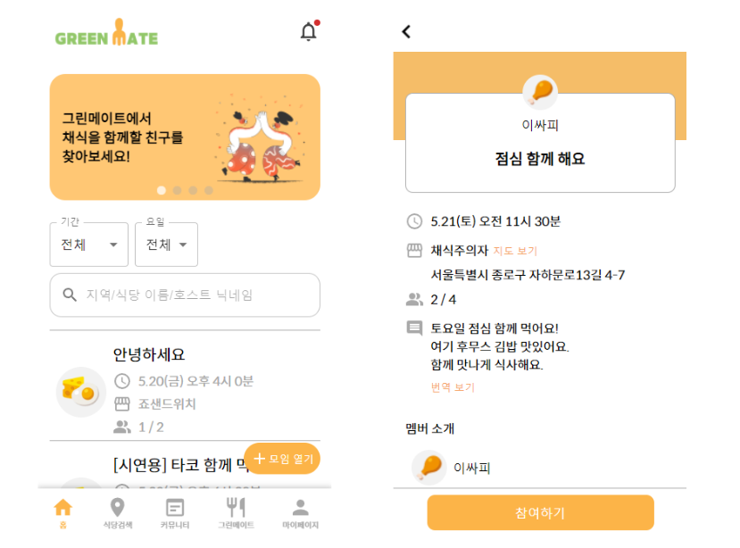
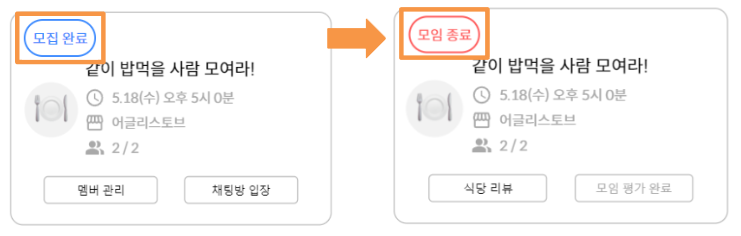
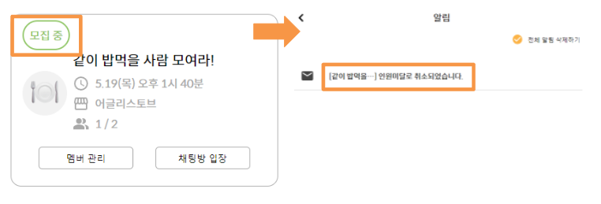
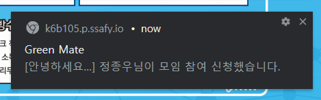
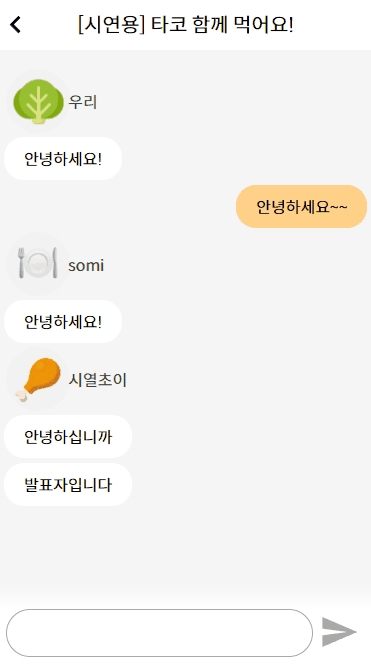
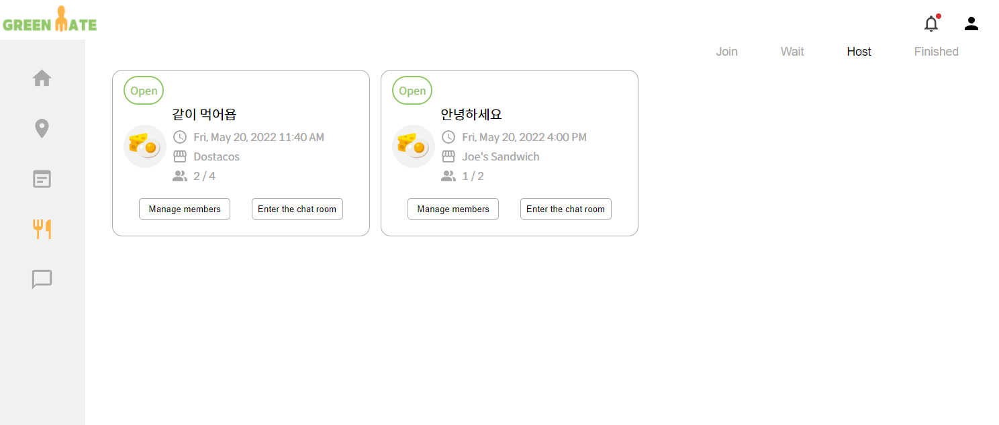
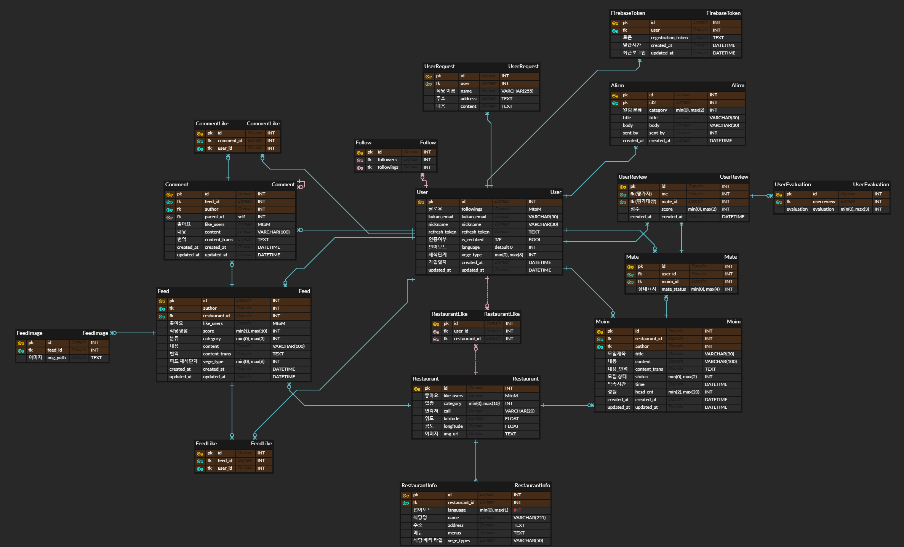

<center>


</center>

# 그린메이트
> 채식 메이트 매칭 및 커뮤니티 서비스

<br />

## 목차


[프로젝트 소개](##서비스-소개)

[주요 기능](##주요-기능)

[기술 스택](##기술-스택)

[프로젝트 구조](##프로젝트-구조)

[사용 방법](##사용-방법)

[팀 소개](##팀-소개)

[개발 기간 및 일정](#개발-기간-및-일정)

[실행 방법](#실행-방법)

[개선할 점](#개선할-점)

<br />

## 서비스 소개

**그린메이트(GREEN MATE)** 는 채식을 지향하고 있는 사람들이 정보를 공유하고, 모임을 만들어 채식식당에서 함께 식사할 수 있는 서비스입니다.

우리나라에서는 채식을 하나의 라이프 스타일로 인정하지 않는 사람들, 부족한 인프라 등의 이유로 채식을 지향하는 사람들이 주변 사람들과 식사할 때 어려움을 많이 겪습니다. 저희는 이러한 어려움을 해소하고자 그린메이트를 만들었습니다.

<br />

## 주요 기능

### 메이트 구하기

#### 모임 생성/참여

- 직접 모임을 열거나, 다른 사람이 만든 모임에 참여할 수 있습니다.



#### 모임 상태 자동 업데이트

- 모임 시간이 지나면 모집 완료에서 모임 종료 상태로 변경되고, 종료된 모임에 대해 메이트 평가를 남길 수 있습니다.



- 모임 시간 2시간 전까지 인원이 채워지지 않았다면 해당 모임은 자동으로 취소됩니다. 내가 해당 모임에 참여 중이었다면 취소 알림을 받게 됩니다.



#### 푸시 알림

- 내가 만든 모임에 대한 참여 신청, 내가 신청한 모임에 대한 신청 수락, 채팅 등 모임과 관련된 다양한 푸시 알림을 받을 수 있습니다.



#### 채팅

- 모임에 참여하는 유저 간에 1:N 채팅을 할 수 있습니다.




### 채식 식당 지도

- 서울 내에 있는 채식 식당을 찾고 관련 정보를 얻을 수 있습니다.
- 해당 식당에서 열리는 모임을 검색할 수 있습니다.


### 다국어 서비스

- 우리나라에서 채식을 하는 외국인들도 관련 모임에 참여하고 정보를 얻을 수 있도록 언어 설정 기능을 추가했습니다.
- 한국어, 영어 중에 선택할 수 있습니다.



<br />

## 기술 스택

### Frontend

|  |  |  |
| :----------------------------------------------------------: | :----------------------------------------------------------: | :----------------------------------------------------------: |
|                            HTML5                             |                             CSS3                             |                          JavaScript                          |

|  |  |  |  |
| :----------------------------------------------------------: | :----------------------------------------------------------: | :----------------------------------------------------------: | ------------------------------------------------------------ |
|                            React                             |                            Jotai                             |                      Styled Components                       | MUI                                                          |

### Backend

|  |  |  |
| :----------------------------------------------------------: | :----------------------------------------------------------: | :----------------------------------------------------------: |
|                    Django Rest Framework                     |                            MySQL                             |                            uWSGI                             |

|  |  |
| :----------------------------------------------------------: | :----------------------------------------------------------: |
|                           Postman                            |                           Swagger                            |

### **DevOps**

|  |  |
| :----------------------------------------------------------: | :----------------------------------------------------------: |
|                            NGiNX                             |                             aws                              |


<br />

## 프로젝트 구조

### 아키텍처


### ERD



<br />

## 팀 소개

### Frontend

👭 원유진: 와이어프레임 제작, 모임 생성/수정/삭제/평가 서비스 개발

👑 최승연: 팀장, 와이어프레임 제작, 로그인/회원가입 서비스 개발, 채식 식당 지도 서비스 개발

💬 한우리: 와이어프레임 제작, firebase를 이용한 채팅 및 알림 기능 구현

### Backend

⏱ 박소미: DB 설계, 모임 생성/수정/삭제/평가 도메인 개발, APScheduler를 이용한 모임 상태 자동 업데이트 적용

📲 백민아: DB 설계, 로그인/회원가입 도메인 개발, 채식 식당 조회/검색 도메인 개발

### Fullstack

🔍 최시열: DB 설계, 커뮤니티 도메인 개발, 배포

<br />

## 개발 기간 및 일정

#### 전체 기간 2022. 04. 11 ~ 2022. 05. 20

##### `1 ~ 2주차 - 기획(2022. 04. 11 ~ 2022. 04. 22)`

- 브레인스토밍, 기획
- 아이디어 확정 및 기술 스택 검토

##### `3주차 - 와이어프레임과 DB 설계, API 문서 작성(2022. 03. 14 ~ 2022. 03. 18)`

- ERD 작성
- 와이어프레임 작성
- API 문서 작성

##### `4 ~ 6 주차 - 개발, 배포 (2022. 04. 25 ~ 2022. 05. 13)`

- RESTful API 구현
- 와이어프레임 바탕으로 UI, UX 구현
- firebase 기반 채팅 구현

##### `7 주차 - 프로젝트 마무리 (2022. 05. 16 ~ 2022. 05. 20)`

- PWA 적용
- 버그 수정
- UCC 제작

<br />

## 실행 방법

- 원격 저장소 복제
```bash
$ git clone https://lab.ssafy.com/s06-final/S06P31B105.git
```

- Frontend

```bash
$ cd frontend
$ npm install
$ npm start
```

- Backend

```bash
$ cd backend
$ python -m venv venv
$ source venv/Scripts/activate
$ pip install -r requirements.txt
```

<br />

## 개선할 점

- 위치 기반 모임 추천
- 서울뿐만 아니라 전국의 채식 식당 데이터 수집
- 제품 바코드 분석/원재료 목록 스캔을 통한 비건 여부 판별
- 사용자 신고 등 서비스 정책 정교화