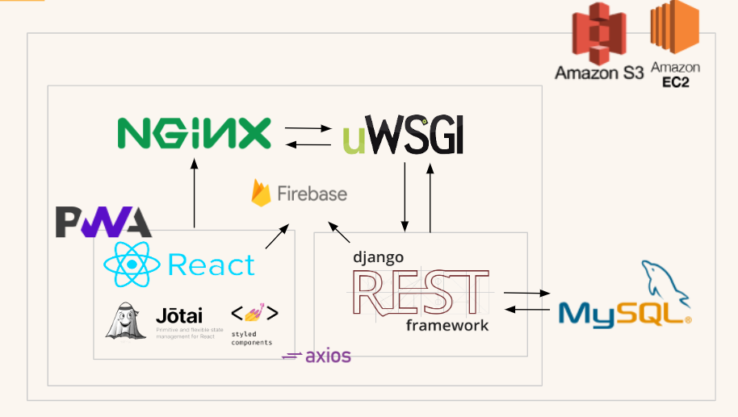

# [ 🔥 기본적인 배포 과정 ]

> MobaXterm(EC2 환경을 GUI로!!!!)에서 진행하였습니다.
>
> MobaXterm : SSH 프로토콜을 windows 환경에서 보다 쉽게 접근하기 위한 클라이언트
>
> Django와 React를 활용해 Backend 및 Frontend를 구현하였습니다.
>
> mariaDB를 활용해 Database를 구축하였습니다.


## 💠 MobaXterm 기본 설정

### 🔸 기본 명령어

```shell
# root로 접근
$ sudo su

# 운영체제에서 사용 가능한 패키지들과 그 버전에 대한 정보를 업데이트하는 명령어
# 설치되어 있는 패키지를 최신으로 업데이트하는 것이 아닌 설치가능한 리스트를 업데이트
$ sudo apt-get update

# 서버 업데이트 후 재시작
$ sudo systemctl daemon-reload
$ sudo systemctl restart uwsgi nginx
```


### 🔸 Session 설정

- Session ➡ SSH ➡ Remote host *에 ubuntu@도메인(k6b105.p.ssafy.io) 입력
- Advanced SSH settings의 Use private key 선택 ➡ 제공받은 인증키(.pem) 등록 ➡ OK


### 🔸 nginX 설정

 ```shell
 # nginX 설치
 $ sudo apt-get install nginx
 
 # nginX 시작
 $ sudo service nginx start
 
 # nginx 중지
 $ sudo service nginx stop
 
 # nginx 재시작
 $ sudo service nginx restart
 ```

>nginX 시작 후 도메인(k6b105.p.ssafy.io)에 접속하면 Welcome 페이지 보이면 설치 완료


### 🔸 mySQL 설정

```shell
# mySQL 설치
$ sudo apt-get install mysql-server

# 관리자 권한으로 접속
$ sudo su

# mySQL 시작
$ mySQL -u root -p
```

> 초기에는 root계정에 비밀번호가 없다.
>
> 참고 자료에 따라 mySQL 비밀번호를 설정 후에
>
> 비밀번호 입력을 거쳐 mySQL을 시작할 수 있다.
>
> 참고: https://velog.io/@issac/AWS-EC2%EC%97%90-MySQL-%EC%84%9C%EB%B2%84-%EA%B5%AC%EC%B6%95%ED%95%98%EA%B8%B0


#### mySQL 권한부여

1. mariaDB가 실행중인지, 활성화 되어 있는지 확인합니다.

   ```shell
   $ sudo systemctl status mySQL
   ```

2. 계정에 대한 권한

   ```shell
   # 접근 가능한 계정 정보 조회
   # %는 모든 ip에서 접근 허용!
   SELECT host, user, password FROM mysql.user;
   
   # root 계정은 모든 ip에서 접근 허용
   # kkubook204는 root계정 비밀번호 입니다!
   GRANT ALL privileges on *.* to 'greenmate'@'%' identified by greenmate;
   
   # 수정한 내용 저장
   FLUSH PRIVILEGES;
   ```
   


## 💠 Frontend

- React의 경우 `npm run build` 명령어를 활용해 생성되는 build 파일을 그대로 배포 가능합니다.

  (MobaXterm을 사용하기 때문에 Drag & Drop 사용 가능!!)

💢 **주의 사항** 💢

- pakage.json의 필요한 파일을 설치하는 것과 관계가 있을지 정확히 조사해 보지 않았지만

  찜찜해서 `npm i` 후 `npm run build` 하였습니다.

- 정확히 하자면 .env 파일을 개발과 배포 등으로 나누어 작성해야 하지만 프로젝트 기간안에 배포를 마무리

  해야 하는 일정상의 문제로 같은 .env파일을 사용하였습니다. 반드시 이 파일을 넣고 build 해야 합니다!
  
- 개발 시 localhost로 연결해 둔 부분을 배포된 도메인으로 바꿔주어야 합니다.


### 1️⃣ 빌드

빌드가 완료 되었다면 MobaXterm에 build 파일을 그대로 가져다 넣기. (경로는 /home/ubuntu/)


### 2️⃣ frontend.conf

다음의 명령어를 통해 frontend config 파일을 설정합니다.

> 이것은 frontend build 파일의 경로를 알려주고 어느 uri에서 보여줄지, 에러상황 등의 내용을 설정하는 것이다.

```shell
$ sudo vim /etc/nginx/sites-available/frontend.conf
```

💫 vi와 vim : 거의 동일한 역할(편집)을 하지만 파일이 존재하지 않을 때(초기에 설정할 때)는 vim 명령어를 사용!


명령어를 통해 편집기 안으로 들어왔으면 자신의 프로젝트에 맞게 내용을 적습니다.

> 주석(#)은 지운다

```
server {
  listen  80 default;
  server_name k6b105.p.ssafy.io;
  
  location / {
  	return 301 https://k6b105.p.ssafy.io$request_uri;
  }
}

server {
  listen	443 ssl default;
  server_name k6b105.p.ssafy.io;
  
  ssl_certificate	/etc/letsencrypt/live/k6b105.p.ssafy.io/fullchain.pem;
  ssl_certificate_key	/etc/letsencrypt/live/k6b105.p.ssafy.io/privkey.pem;
  
  location / {
  root	/home/ubuntu/build/;
  index	index.html;
  try_files	$uri $uri/ /index.html;
  }
  
  location /api {
    proxy_pass http://k6b105.p.ssafy.io:8070;
  }
}
```


### 3️⃣ sites-enabled

이것을 `sites-enabled` 폴더에 심볼릭 링크로 지정합니다.

```shell
$ sudo ln -s /etc/nginx/sites-available/frontend.conf /etc/nginx/sites-enabled/frontend.conf
```


`sites-enabled`로 이동해서

```shell
cd /etc/nginx/sites-enabled/
```

리스트를 찍어보면 (`ls`)  frontend.conf 파일이 잘 생성된 것을 볼 수 있습니다.

이 때, 기본 설정인 `default`가 존재한다면 `sudo rm default`를 통해 지워주도록 합니다.


### 4️⃣ 마지막

아래 명령어를 통해 nginx를 재시작하고 도메인으로 접속하면 frontend 화면이 잘 보이게 됩니다.

```shell
$ sudo service nginx restart
```


**만약**, 잘나오지 않는다면 `sudo nginx -t` 명령어를 활용해 test 해보고 nginx가 어떤 문제가 있는지 확인해 볼 수 있습니다.


> 참고 : https://www.vompressor.com/setting-nginx-1/


## 💠 Backend

> 기본적으로 다음 블로그를 따라서 배포를 진행하였습니다!
>
> https://nerogarret.tistory.com/45?category=800142


### ◼ 기본 진행 과정

1. /srv/에 ubuntu 권한 부여

2. /srv/에 git clone 받기 (branch는 deploy로)

3. /home/ubuntu/ 에 가상환경 (venv) 설정

4. /srv/S06P22B204/backend 에서 requirement.txt 등 서버가 구동하기 위한 기본 설정

5. 가상환경에서 uwsgi를 django 프로젝트와 연결

   > 앞서 설정한 niginx를 바탕으로 그 웹서버 위에 장고를 올릴 것입니다. (uwsgi 활용! - 가상환경에서 `pip3 install uwsgi` 필요)

6. nginx 서버에서 프로젝트 구동


`들어가기 전에....`

### ◼ 방화벽 설정

- 아마존에서 인스턴스를 직접 다룰 수 있다면 블로그에 나와있는대로 인바운드 규칙을 따로 설정하는 것이

  되겠으나 터미널에서만 EC2 서버를 만질 수 있기 때문에 방화벽 설정하는 명령어를 따로 명시합니다.
  
- 방화벽 설정은 내가 필요한 포트는 다 열어주어야 합니다!

  (우리 프로젝트에서는 80, 3306, 8000, 3000, 8070, 443번을 열어주었습니다.)

```shell
# firewalld가 잘 설치되어 있는지도 확인해보기!

# 방화벽 설정 확인하기
$ sudo firewall-cmd --zone=public --list-all

# 포트 추가
$ sudo firewall-cmd --permanent --zone=public --add-port='넣고 싶은 포트 번호'/tcp

# 포트 삭제
$ sudo firewall-cmd --permanent --zone=public --remove-port='삭제할 포트 번호'/tcp

# 적용을 위해서는 서비스 재구동
$ sudo firewall-cmd --reload
```


### ◼ static 파일 문제

- static 경로를 설정해 주는 오류 (Permission denied)

- 구글링 해도 결과가 만족스럽지 못해서 이런 저런 방법을 시도해 보다가

  아래와 같은 코드 라인으로 해결. but S06P22B204 디렉토리 아래가 아닌 동등한 레벨에서 static 폴더 생성되어 그렇게
  
  nginx conf 파일도 설정해주었습니다!

```django
ROOT_DIR = os.path.dirname(BASE_DIR)

STATIC_URL = '/static/'

STATIC_ROOT = os.path.join(ROOT_DIR, 'static')
```


### ◼ SECRET_KEY 값 숨기기

- django secret key를 숨기기 위해서 secrets.json 파일을 생성하여 숨겼습니다. 
- MobaXterm을 활용했기 때문에 ubnuntu에 직접 파일을 옮겼습니다 (gitlab을 거치치 않음)

> 참고: https://integer-ji.tistory.com/303


- 파일 옮길 때 옮겨지지 않으면 권한 문제이기 때문에 마지막 명령어로 권한을 줘서 옮겨질 수 있게 설정 해주세요!

```shell
# 파일 옮기는 명령어
$ mv /home/ubuntu/~~~~~~ . # 현재 위치

# + 이름 바꾸기
$ mv 현재이름 바꿀이름

# 권한 주기
$ chmod 666 ./~~~~
```

> 참고: https://devks.tistory.com/47


### ◼ 환경변수 설정

- deploy branch에 .config 폴더를 따로 생성하여 환경변수를 보다 용이하게 하도록 했습니다.

  ```
  .config
  
  ├── nginx
  
  │   └── mysite.conf
  
  └── uwsgi
  
  │   └── mysite.ini
  ```

#### .config

- nginx/backend.conf

```
server {
    listen 8070;
    server_name k6b105.p.ssafy.io;
    charset utf-8;
    client_max_body_size 128M;
 
    location / {
        uwsgi_pass  unix:///tmp/backend.sock;
        include     uwsgi_params;
    }

    location /static/ {
        alias /srv/static/;
    }
}
```

- uwsgi/backend.ini

```
[uwsgi]
chdir = /srv/S06P31B105/
module = backend.wsgi:application
home = /home/ubuntu/venv/
 
uid = ubuntu
gid = ubuntu
 
socket = /tmp/backend.sock
chmod-socket = 666
chown-socket = ubuntu:ubuntu
 
enable-threads = true
master = true
vacuum = true
pidfile = /tmp/backend.pid
logto = /var/log/uwsgi/backend/@(exec://date +%%Y-%%m-%%d).log
log-reopen = true
```

- uwsgi/uwsgi.service

```
[Unit]
Description=uWSGI service
After=syslog.target
 
[Service]
ExecStart=/home/ubuntu/venv/bin/uwsgi -i /srv/S06P22B204/.config/uwsgi/backend.ini
 
Restart=always
KillSignal=SIGQUIT
Type=notify
StandardError=syslog
NotifyAccess=all
 
[Install]
WantedBy=multi-user.target
```


- 데몬을 활용해 백그라운드에서 명령어 없이 항상 실행 할 수 있도록 하였습니다.

  다음의 명령어를 활용해 링크를 걸어 줄 수 있습니다.

  ```shell
  $ sudo ln -f /srv/S06P31B105/backend/.config/uwsgi/uwsgi.service /etc/systemd/system/uwsgi.service
  ```

- 다음으로, nginx 설정파일이 프로젝트 안에 있으므로 경로를 이용한 등록 명령어를 활용합니다.

  ```shell
  # sites-available에 복사
  $ sudo cp -f /srv/S06P31B105/backend/.config/nginx/backend.conf /etc/nginx/sites-available/backend.conf
  
  # sites-enables에 링크
  $ sudo ln -sf /etc/nginx/sites-available/backend.conf /etc/nginx/sites-enabled/backend.conf
  
  # sites-enables의 default 삭제
  $ sudo rm /etc/nginx/sites-enabled/default
  ```

  > 이후 반드시 서버 재시작
  >
  > $ sudo systemctl daemon-reload
  > $ sudo systemctl restart uwsgi nginx


# [ 🔥 배포 아키텍쳐 ]


